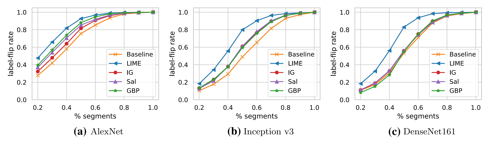
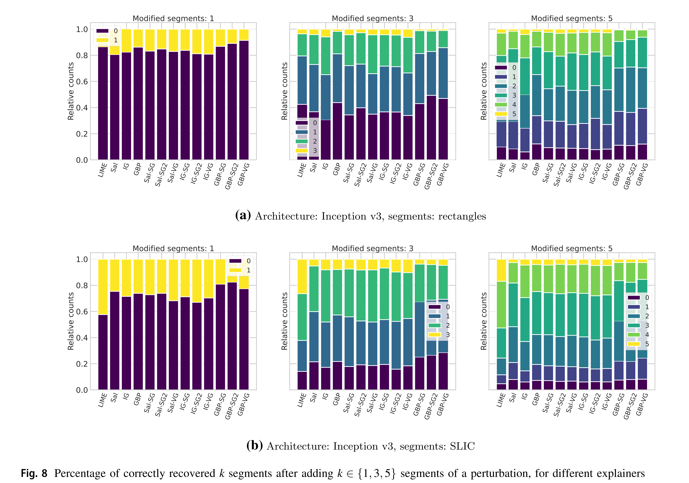

# Reproducing Figures and Tables: Image Domain

In what follows, we show how the main figures and tables concerning the 
experiments in the image domain can be reproduced. 

## Figure 1: Visualised Standard Explainers and Figure A1: Visualised Ensemble Explainers


To reproduce these two figures in which we show examples of how different explanations
could look like, run

```
python -m visualisations.explainer_vis
```

## Table 1: Clean / Adversarial Accuracies


To recreate this table, we first need to compute all necessary adversaries for the 
5 different models. This can be done as follows:
```
python -m prep.compute_advs --data-path <your-path-to-ImageNet> --arch alexnet --radius 0.1
python -m prep.compute_advs --data-path <your-path-to-ImageNet> --arch vgg --radius 0.05
python -m prep.compute_advs --data-path <your-path-to-ImageNet> --arch resnet --radius 0.05
python -m prep.compute_advs --data-path <your-path-to-ImageNet> --arch densenet --radius 0.05
python -m prep.compute_advs --data-path <your-path-to-ImageNet> --arch inceptionv3 --radius 0.05
```

The accuracy of the models on the (clean) validation data can be obtained by calling:
```
python -m prep.clean_accuracies --data-path <your-path-to-ImageNet>
```

where you need to set the path pointing to your ImageNet data.

After you computed all adversaries, you can compute the adversarial accuracy stated
in the third column by calling 

```
python -m prep.adv_accuracies --data-path <your-path-to-ImageNet> --adv-path <path-to-adversaries>
```

which computes the accuracies for all architectures. For the last column you can check yourself
how many adversaries were found for a particular model, e.g. by navigating to the according folder
and calling 

```
find . -name "*.npy" | wc -l
```

## Figure 4: Aggregated Attributions


To reproduce the figure in which we show how we could aggregate different 
pixel-wise attribution maps, you can call

```
python -m visualisations.aggregation_vis
```

## Interlude: Prepare for remaining tables & figures...

For all subsequent experiments, we pre-computed SLIC segments to be used as 
interpretable features. You can do this by calling e.g. 

```
python -m prep.compute_masks --data-path <your-path-to-ImageNet> --adv-path adversaries --arch alexnet
python -m prep.compute_masks --data-path <your-path-to-ImageNet> --adv-path adversaries --arch vgg
python -m prep.compute_masks --data-path <your-path-to-ImageNet> --adv-path adversaries --arch resnet
python -m prep.compute_masks --data-path <your-path-to-ImageNet> --adv-path adversaries --arch densenet
python -m prep.compute_masks --data-path <your-path-to-ImageNet> --adv-path adversaries --arch inceptionv3
```

Due to the implementation of the SLIC function this is **not** done on the GPU - if the above computations
are too slow for you, try to parallelise it, e.g. by using
```
seq 0 5000 45000 | xargs -I% -P10 -n1 python -m prep.compute_masks --data-path <your-path-to-ImageNet> --adv-path adversaries --arch alexnet --nr_files 5000 --start %
```

to run 10 processes in parallel that tackle different files of the whole validation set.

*Note that the results might vary slightly from the masks that we used for the
reported results - if you have issues with reproducing the results and require our masks,
don't hesitate to contact us.*

## Tables 2 & 3: Using a Fixed Number of Interpretable Features


As these tables summarise a lot of results (we compute label-flip rates with a
fixed k=3 for all model-explainer combinations), we provide two scripts that
run all necessary python commands for you, you only have to adapt the `data-path`
(pointing to ImageNet) and the `adv-path` (where adversaries are stored) first, 
and then call
``` 
python -m scripts.run_lf_std
```
and, respectively
``` 
python -m scripts.run_lf_ens
```

The two scripts also perform experiments on rectangular image segments (achieved by
omitting the `--segment` flag). The according results are reported in Tables 4 and 5
in the Appendix.

To create the (latex) tables from the `pickle` files that are saved during above 
experiments, we also provide a script you can run as follows:

``` 
python -m visualisations.create_fixedk_tables
```

## Figure 5 - 7: Varying the Number of Interpretable Features




To reproduce Figures 5, 6 and 7, we build upon the results you obtained for previous 
experiments, so if you skipped it in the previous section, you will have to have run 

``` 
python -m scripts.run_lf_std
python -m scripts.run_lf_ens
```

Then, you can run the following script to plot the results as done in the paper:

``` 
python -m visualisations.label_flip_vis
```

## Figure 8: Explaining "Localised" Perturbations



To reproduce Figure 8 (a) and (b), we first need to run some experiments again. 
To compute the percentage of correctly recovered segments (from k = 1, 3 or 5 segments)
for various explainers, we need to run the experiments of `experiments/localised_attack`
with a number of different settings (e.g., for different types of segmentation).
We again provide a script that should simply this,
which means you can run

``` 
python -m scripts.run_local_attack
```

to get all the results you need. Thereafter, you can call

``` 
python -m visualisations.localised_adv_vis
```

to create the two plots depicted in Figure 8.